# Capacitance-to-Digital Converter for MEMS Microphone Digitisation (180 nm CMOS)

> A time-encoded capacitance-to-digital converter (CDC) with switched-capacitor feedback, designed in 180 nm CMOS, for bias-free readout of MEMS capacitive microphones and microfluidic interdigitated-electrode sensors.

---

## Overview

This project presents a closed-loop, time-domain readout architecture for capacitive sensors. The sensing capacitor (MEMS microphone or IDE microfluidic sensor) is embedded directly inside a switched-capacitor (SC) feedback loop around a ring oscillator. Capacitance variations are converted directly into oscillation frequency without intermediate voltage-domain processing, eliminating conventional charge pumps and high-voltage biasing circuits.

The design was implemented and simulated in **Cadence Virtuoso** using a **180 nm CMOS** technology node.

---

## Problem Statement

Conventional MEMS microphone readout circuits operate on a constant-charge principle, which requires:

- **High-voltage sensor biasing** (10–20 V) using charge pumps
- **Giga-ohm resistors** creating high-impedance, noise-sensitive bias nodes
- **Multiple analog processing stages** (amplifiers, integrators, DACs)
- **Poor CMOS scalability** — unsuitable for always-on, compact, low-power systems

These constraints limit integration and power efficiency for modern wearable, IoT, and lab-on-chip applications.

---

## Objectives

- Design a bias-free capacitance-to-digital converter that eliminates charge pumps and high-voltage biasing
- Directly encode sensing capacitance into oscillation frequency using SC feedback
- Achieve attofarad-level capacitance noise resolution
- Validate the architecture through Cadence Spectre simulation (pre-layout and post-layout)
- Demonstrate suitability for both MEMS microphone and microfluidic IDE sensor applications

---

## Key Specifications (From Design and Simulation)

| Parameter | Value |
|---|---|
| CMOS Technology | 180 nm |
| Active Area | 0.025 mm² |
| Power Consumption | 1343 µW |
| Bias Current (I_BIAS) | 39 µA |
| Reference Voltage (V_BIAS) | 1.4 V |
| Nominal Sensor Capacitance | 2.575 pF |
| Oscillation / Sampling Frequency | 16.6 MHz |
| Frequency Divider Ratio (N) | 2 |
| Noise Integration Bandwidth | 300 Hz – 6.8 kHz |
| Capacitance Noise (RMS) | **1.7 – 2.9 aF** |
| Peak SNDR | ~50 dB |

> **Source:** Cadence Spectre simulation results as reported in the project technical report.

---

## System Architecture

```
MEMS Microphone / IDE Sensor (C_sensor = 2.575 pF)
                │
                ▼
    ┌───────────────────────────────────────────┐
    │         SC Feedback Loop                  │
    │                                           │
    │  Bandgap Reference (BGR)                  │
    │       │                                   │
    │       ▼                                   │
    │  Constant Current Source (I_BIAS = 39 µA) │
    │       │                                   │
    │       ▼                                   │
    │  Integration Capacitor (C_A)  ◄───────┐  │
    │       │                               │  │
    │       ▼                               │  │
    │  OTA (gain stage / feedback monitor)  │  │
    │       │                               │  │
    │       ▼                               │  │
    │  Ring Oscillator (VCO)                │  │
    │       │                               │  │
    │       ▼                               │  │
    │  Schmitt Trigger (noise / jitter)     │  │
    │       │                               │  │
    │       ▼                               │  │
    │  SC Network ──── C_sensor ────────────┘  │
    └───────────────────────────────────────────┘
                │
                ▼
        Frequency Divider (÷N, N=2)
                │
                ▼
        Frequency-to-Digital Converter (F2D)
                │
                ▼
         Digital Output Code
```

**Operating principle:** The bias current charges C_A steadily. The SC network periodically transfers charge between C_sensor and C_A. The ring oscillator frequency auto-adjusts to maintain equilibrium — making frequency directly proportional to 1/C_sensor. Any change in C_sensor (due to sound pressure or microfluidic permittivity shift) appears as a frequency shift at the digital output.

---

## Circuit Blocks

| Block | Function |
|---|---|
| Bandgap Reference (BGR) | PVT-stable voltage and current reference |
| Constant Current Source | Charges C_A at fixed rate (39 µA) |
| Integration Capacitor (C_A) | Charge accumulation node |
| OTA | Gain + feedback stabilization, bias point control |
| Ring Oscillator | Core VCO — frequency encodes capacitance |
| Schmitt Trigger | Removes noise and slow transitions; adds hysteresis |
| Switched-Capacitor (SC) Network | Transfers charge proportional to C_sensor each cycle |
| Frequency Divider (÷2) | Reduces oscillation frequency before digital conversion |
| Frequency-to-Digital Converter (F2D) | Converts frequency to binary output code |

---

## Tools & Technology

| Tool / Technology | Purpose |
|---|---|
| Cadence Virtuoso | Schematic capture and layout design |
| Cadence Spectre | Transient simulation, noise analysis |
| 180 nm CMOS PDK | Technology node for implementation |

---

## Simulation Results

All results obtained from Cadence Spectre simulation (pre-layout and post-layout).

| Block | Simulation |
|---|---|
| Ring Oscillator | Oscillation frequency: 16.6 MHz |
| OTA | Output waveform verified |
| Frequency Divider (÷2) | Divide-by-2 output verified |
| Frequency-to-Digital (F2D) | Digital output code verified |
| Full CDC output | Frequency shift with capacitance change verified |
| Noise bandwidth | 300 Hz – 6.8 kHz |
| Capacitance noise resolution | 1.7 – 2.9 aF RMS |

### Simulation Waveforms

| Block | Image |
|---|---|
| CDC system output | 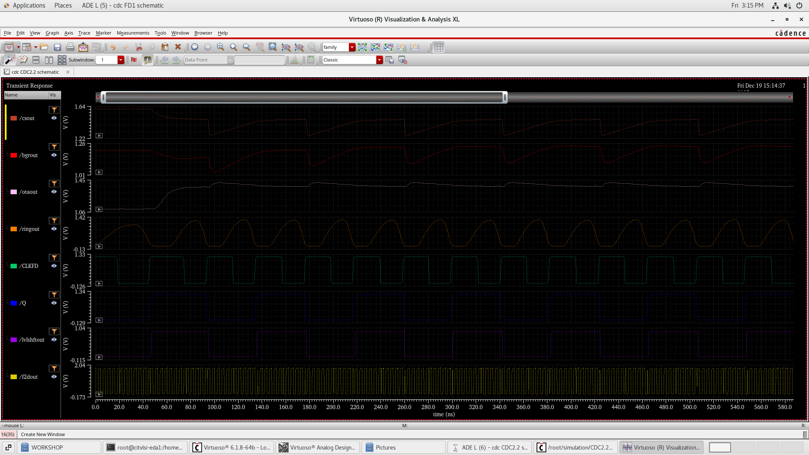 |
| OTA output | 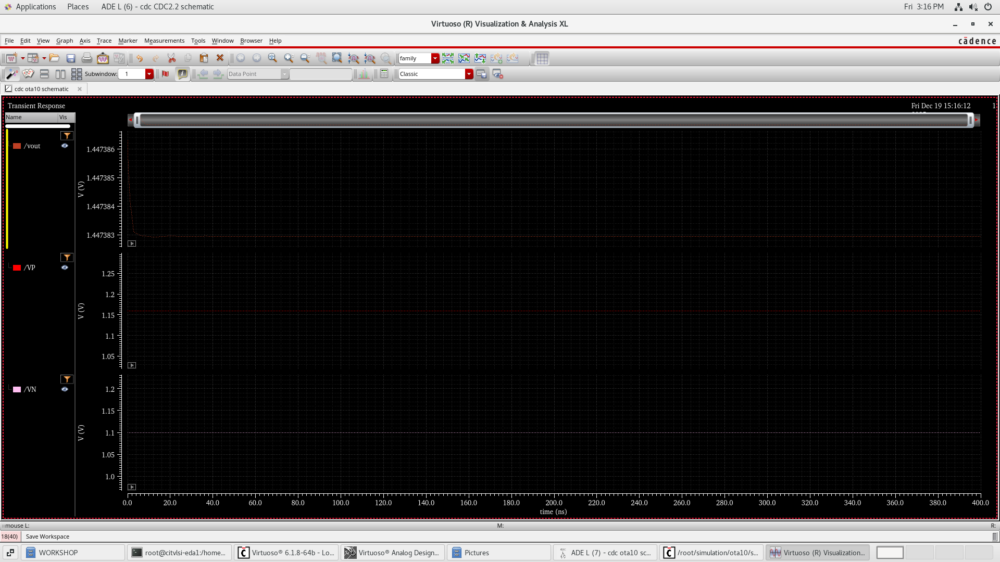 |
| Ring oscillator output | 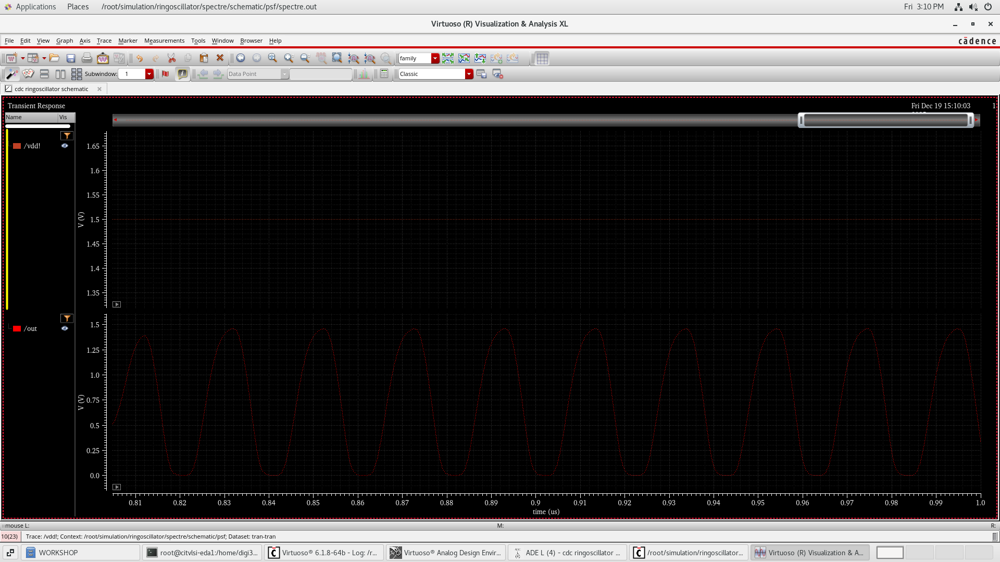 |
| Frequency divider output | 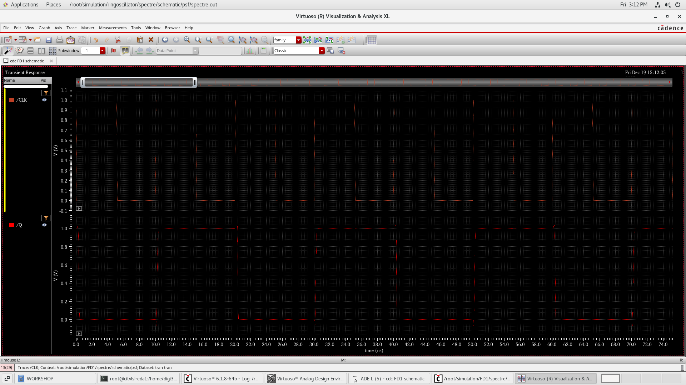 |
| Frequency-to-digital output | 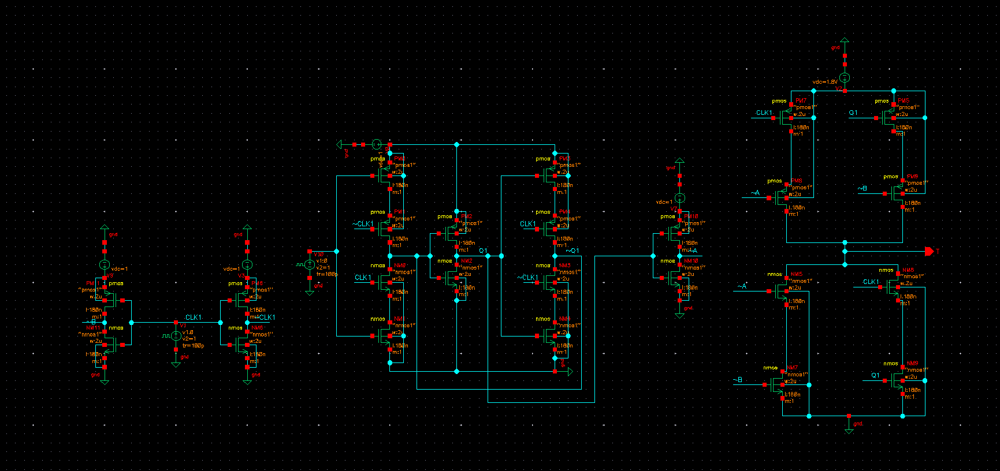 |

---

## Schematics

| Block | Image |
|---|---|
| Bandgap Reference (BGR) | 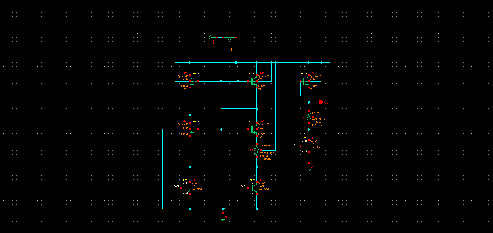 |
| OTA | 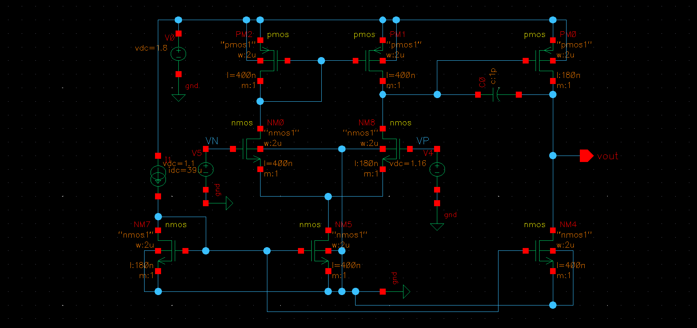 |
| Ring Oscillator | 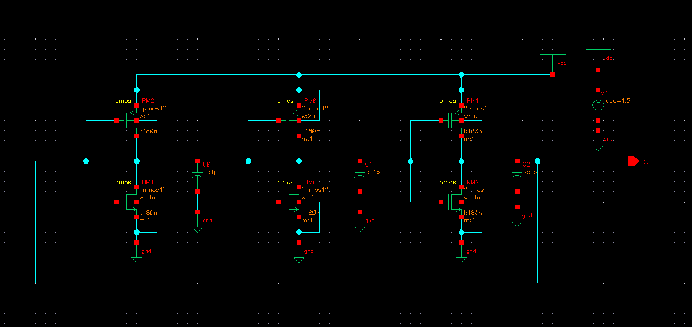 |
| Level Shifter | 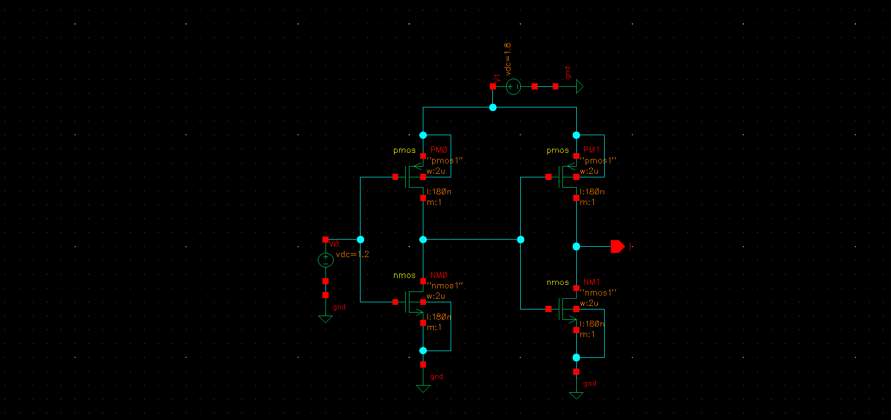 |
| Frequency Divider | 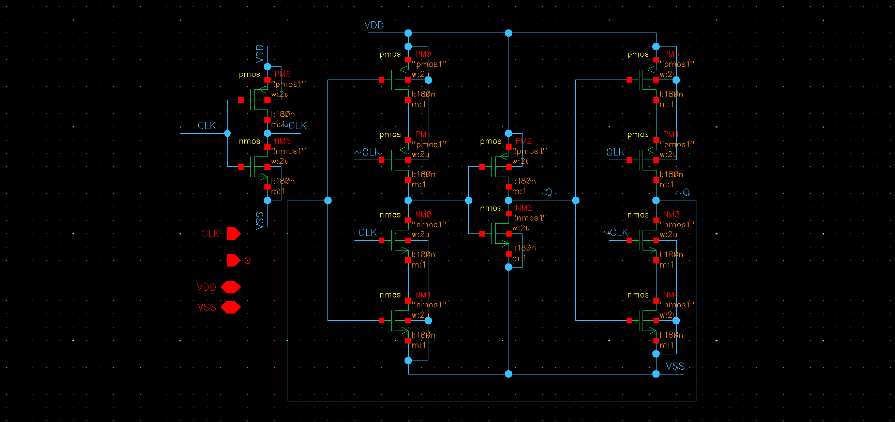 |

---

## Layout

| Block | Image |
|---|---|
| Frequency Divider layout | 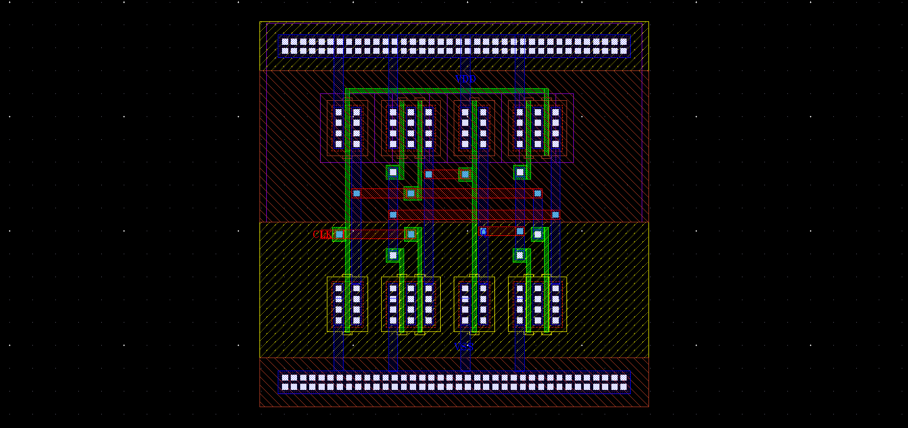 |
| Frequency-to-Digital layout | 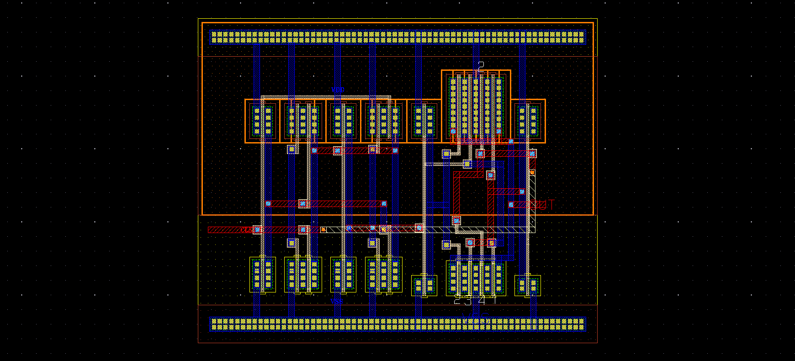 |
| Full Cadence Virtuoso layout | 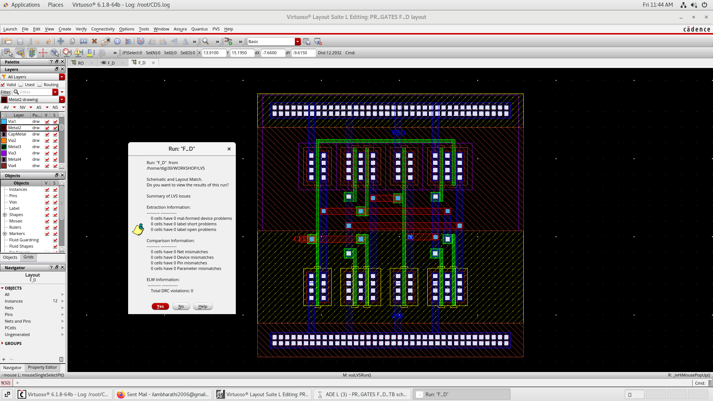 |

---

## Comparison with State-of-the-Art

| Parameter | SAR CDC [JSSC'19] | CT-Σ∆ CDC [JSSC'22] | Zoom CDC [JSSC'20] | Microfluidic CDC (Lit.) | **This Work** |
|---|---|---|---|---|---|
| Technology | 65 nm | 180 nm | 55 nm | 180–350 nm | **180 nm** |
| Architecture | SAR-based | Continuous-Time Σ∆ | Incremental Zoom | Voltage/Time-based | **Time-Domain SC-feedback** |
| Rest Capacitance | 1–10 pF | 5–50 pF | 2–20 pF | 1–5 pF | **2.575 pF** |
| Bias Current | <10 µA | 50–200 µA | 20–100 µA | 10–100 µA | **39 µA** |
| Reference Voltage | 0.8–1.2 V | 1.0–1.8 V | 1.0–1.5 V | 1.0–2.0 V | **1.4 V** |
| Sampling Frequency | <1 MHz | <5 MHz | 1–10 MHz | <10 MHz | **16.6 MHz** |
| Noise BW | ~10 kHz | ~10 kHz | ~5 kHz | ~1 kHz | **300 Hz – 6.8 kHz** |
| Cap. Noise (RMS) | ~10 aF | 21–115 aF | 8–15 aF | 10–100 aF | **1.7 – 2.9 aF** |
| Sensor Biasing Required | Yes | Yes | Yes | Yes | **No** |

> Source: Table III from the project technical report.

---

## Applications

- Digital MEMS microphones (smartphones, smart speakers, wireless earbuds, hearing aids)
- Voice-controlled IoT devices (always-on audio interfaces)
- Microfluidic lab-on-chip systems (droplet detection, flow monitoring, analyte concentration sensing)
- Bio-sensor interfaces (label-free bioanalytical analysis, single-entity detection)

---

## Repository Structure

```
cdc-mems-microphone-readout/
│
├── README.md
├── .gitignore
│
├── docs/
│   └── images/
│       ├── schematics/
│       │   ├── bgr_schematic.png
│       │   ├── ota_schematic.png
│       │   ├── ring_oscillator_schematic.png
│       │   ├── level_shifter_schematic.png
│       │   └── frequency_divider_schematic.png
│       ├── layout/
│       │   ├── frequency_divider_layout.png
│       │   └── frequency_to_digital_layout.png
│       ├── simulation/
│       │   ├── cdc_output_waveform.png
│       │   ├── ota_output_waveform.png
│       │   ├── ring_oscillator_output.png
│       │   ├── frequency_divider_output.png
│       │   └── frequency_to_digital_output.png
│       └── system/
│           ├── system_block_diagram.png
│           └── cadence_virtuoso_full_layout.png
│
└── reports/
    ├── cdc_technical_report.docx
    ├── cdc_technical_report.pdf
    └── cdc_project_presentation.pptx
```

---

## Limitations

- The current prototype is limited by front-end circuitry noise contributions
- Peak SNDR is constrained to ~50 dB over 300 Hz–6.8 kHz when using a varactor-based test setup to emulate the sensor (no physical MEMS sensor fabricated)
- A fully differential implementation was not explored in this work; this is expected to significantly improve noise rejection
- Further optimization of noise shaping and power consumption is identified as future work
- Cadence layout files (`.cdslck`, cellviews) are not committed — tool-specific proprietary files

---

## Future Work

- Implement a fully differential architecture for improved CMRR and noise performance
- Improve noise shaping to push SNDR beyond 50 dB
- Reduce power consumption below 1343 µW for ultra-low-power always-on applications
- Integrate with a physical MEMS microphone or IDE sensor for hardware validation
- Perform physical tape-out and post-fabrication characterization
- Explore noise shaping techniques (e.g., VCO-ADC noise shaping extensions)

---

## Team

| Name | Reg. No. | Institution |
|---|---|---|
| Ilam Bharathi M | 24EC0066 | Chennai Institute of Technology, ECE |
| Mayurkanthan | 24EC0114 | Chennai Institute of Technology, ECE |

**Guide:** Dr. S. Aathilakshmi, Assistant Professor, ECE Department, Chennai Institute of Technology

**Course:** Core Course Project — AY 2025–26 Even Semester, B.E. ECE II Year

---

## References

1. H. Xin et al., "A 0.1-nW–1-µW energy-efficient all-dynamic versatile CDC," *IEEE JSSC*, vol. 54, no. 7, Jul. 2019. DOI: 10.1109/JSSC.2019.2902754
2. M. Noviello, "A time-encoded CDC based on switched-capacitor feedback," *IEEE Sensors Letters*, vol. 7, no. 11, 2023. DOI: 10.1109/LSENS.2023.3320061
3. "A 0.033-mm² continuous-time CDC," *IEEE JSSC*, vol. 57, no. 10, Oct. 2022. DOI: 10.1109/JSSC.2022.3187137
4. X. Tang et al., "A high-resolution incremental zoom CDC," *IEEE JSSC*, vol. 55, no. 11, Nov. 2020.
5. J. Borgmans et al., "The analog behavior of pseudo-digital ring oscillators in VCO ADCs," *IEEE TCAS-I*, vol. 68, no. 7, Jul. 2021. DOI: 10.1109/TCSI.2021.3073817
6. E. Gutierrez et al., "A PFM interpretation of VCOs enabling VCO-ADC architectures," *IEEE TCAS-I*, vol. 65, no. 2, Feb. 2018.
